<p align="center">
  
  
  
  
  
  
</p>

<h1 align="center">spring-tools.nvim</h1>

<p align="center">
    Spring Boot Dashboard for Neovim.
<br>
    Manage applications, browse endpoints and beans, run tests, inspect configuration, and stream logs from a single sidebar.
</p>

<p align="center">
  <a href="#features">Features</a> •
  <a href="#installation">Installation</a> •
  <a href="#usage">Usage</a> •
  <a href="#configuration">Configuration</a> •
  <a href="#highlights">Highlights</a> •
  <a href="#troubleshooting">Troubleshooting</a>
</p>

<br>

## Previews

<details><summary>Click to expand screenshots and demos</summary>

<br>

<h4 align="center">Dashboard &mdash; project list, start/stop, custom run commands</h4>
<p align="center">
  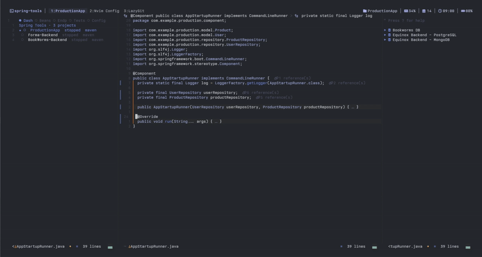
</p>

<h4 align="center">Beans Explorer &mdash; collapsible type sections, nested <code>@Bean</code> methods</h4>
<p align="center">
  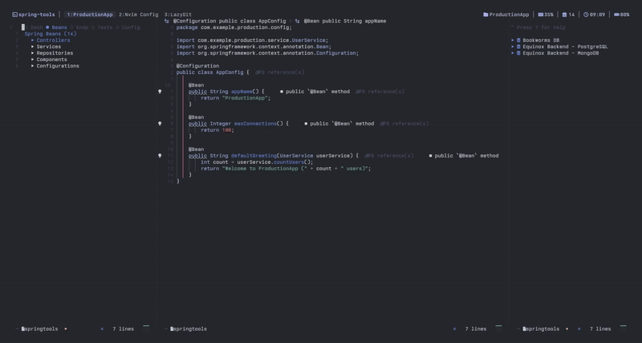
</p>

<h4 align="center">Endpoints Explorer &mdash; routes grouped by HTTP method</h4>
<p align="center">
  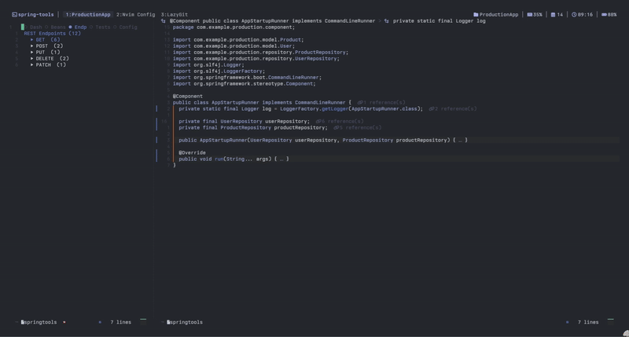
</p>

<h4 align="center">Test Runner &mdash; discover and run JUnit 5 tests, per-method results</h4>
<p align="center">
  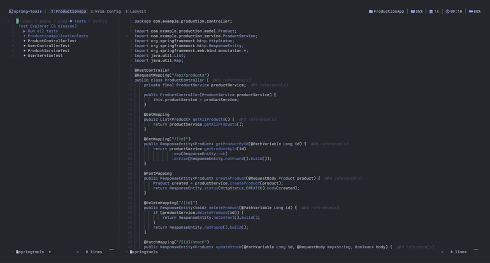
</p>

<h4 align="center">Run All Tests &mdash; batch test execution with surefire reporting</h4>
<p align="center">
  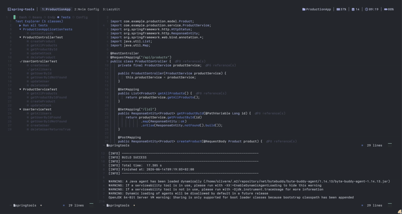
</p>

<h4 align="center">Config Explorer &mdash; browse properties/YAML, preview values, jump to line</h4>
<p align="center">
  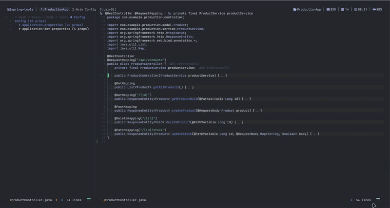
</p>

<h4 align="center">Log Filtering &mdash; color-coded levels (ERROR / WARN / INFO / DEBUG / TRACE) with toggle keys</h4>
<p align="center">
  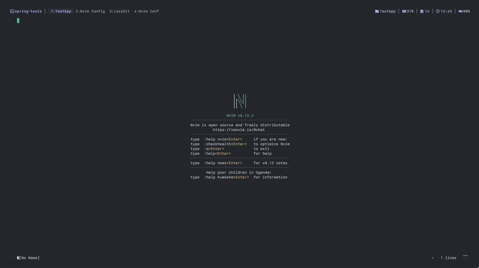
</p>

<h4 align="center">Log Filtering (multiple projects) &mdash; switch between project logs while filtering</h4>
<p align="center">
  
</p>

<h4 align="center">Full Walkthrough &mdash; sidebar navigation, command input, output panel</h4>
<p align="center">
  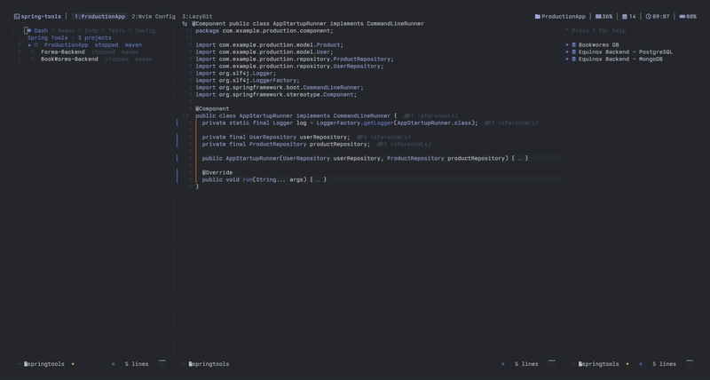
</p>

<h4 align="center">Keybindings Reference</h4>
<p align="center">
  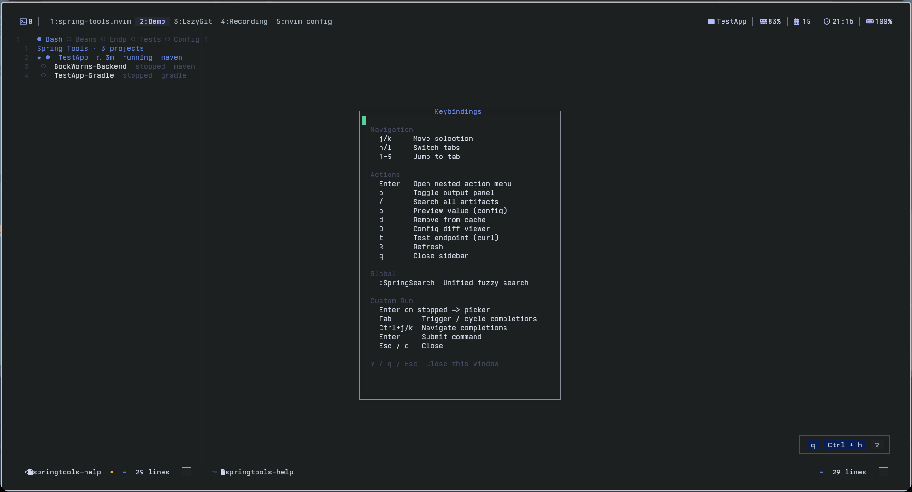
</p>

<h4 align="center">Commands Reference</h4>
<p align="center">
  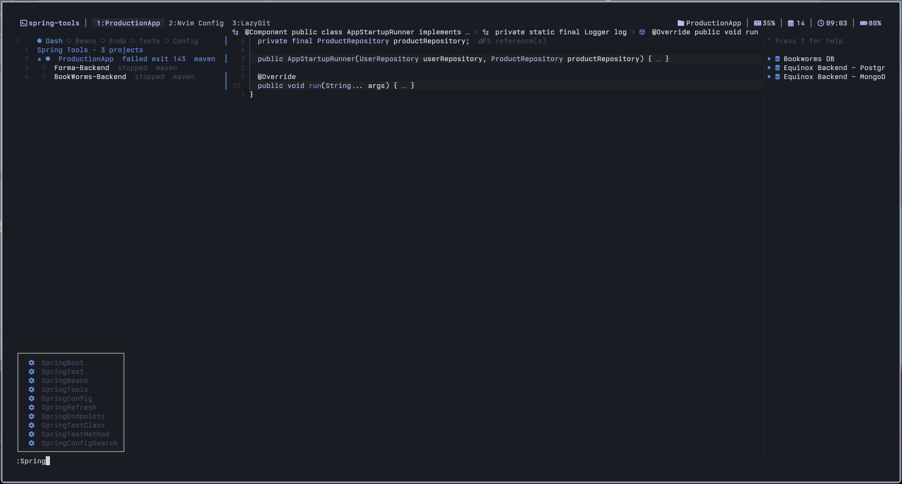
</p>

<h4 align="center">Formatted Output &mdash; compile errors, root cause extraction</h4>
<p align="center">
  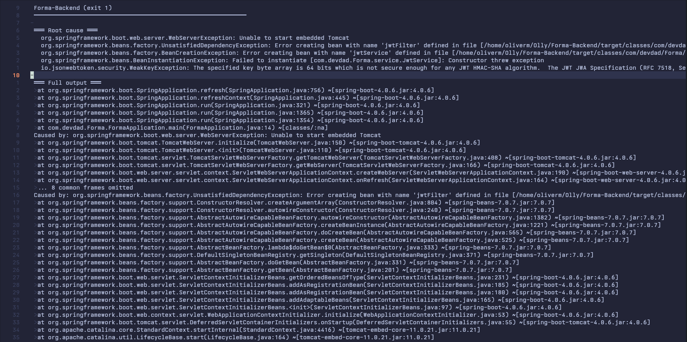
</p>

</details>

## Features

- **Sidebar UI** — persistent left sidebar with 5 tabbed views and `?` help float
- **Output Panel** — bottom split (12 rows, 30% height) for live log streaming
- **Dashboard** — project list with ★ active marker, ●/○ status dots, auto-selects CWD project
- **Nested Action Menu** — Enter on a project opens a structured picker: Recent & default commands, Common commands, Custom run, View logs, Restart/Stop, Open config — recent commands can be deleted inline
- **Command History** — `:SpringCommands` browses all saved custom commands across projects; re-run, copy, or delete
- **Custom Run Command** — floating input with omnifunc completion (mvn lifecycle phases, plugin goals, `-D` properties, Gradle tasks), position configurable (`top`/`center`/`bottom`), locked against window navigation
- **Dynamic Maven Goal Discovery** — auto-discovers plugin goals from `help:effective-pom` and `help:describe` for any Maven plugin, not just 55+ well-known ones; caches across sessions; auto-invalidates on POM changes
- **Bean Explorer** — collapsible sections by stereotype, nested `@Bean` methods under `@Configuration`
- **Endpoint Explorer** — routes grouped by HTTP method (GET/POST/PUT/PATCH/DELETE), collapsible
- **Test Runner** — discover/run JUnit 5 tests, per-method results from surefire XML
- **Config Explorer** — browse application.properties/YAML, file-grouped, preview values with `p`, Enter jumps to exact line
- **Process Manager** — unbuffered I/O, port extraction, exit code tracking
- **Project Cache** — persistent JSON at `~/.local/share/nvim/spring-tools/projects.json`
- **Unified Search** — `:SpringSearch` opens a fuzzy picker across all beans, endpoints, tests, and config properties with nerd-font icons — jumps directly to the definition on selection
- **Auto-restart** — save any file and the app restarts automatically; skips test files, debounces rapid saves, shows changed filename in success line; per-project toggle persists across sessions; optional clean rebuild

<br>

## Installation

<details><summary>lazy.nvim</summary>

```lua
{
  "DevDad-Main/spring-tools.nvim",
  -- Telescope is optional — falls back to vim.ui.select
  dependencies = {
    "nvim-telescope/telescope.nvim",
  },
  config = function()
    require("spring-tools").setup()
  end,
}
```

</details>

<details><summary>packer.nvim</summary>

```lua
use {
  'DevDad-Main/spring-tools.nvim',
  -- Telescope is optional — falls back to vim.ui.select
  requires = {
    'nvim-telescope/telescope.nvim',
  },
  config = function()
    require('spring-tools').setup()
  end,
}
```

</details>

<br>

## Usage

<details><summary>Commands</summary>

| Command                       | Description                                      |
| ----------------------------- | ------------------------------------------------ |
| `:SpringTools`                | Open sidebar (defaults to Dashboard)             |
| `:SpringBoot`                 | Open sidebar on Dashboard                        |
| `:SpringBeans`                | Open sidebar on Beans                            |
| `:SpringEndpoints`            | Open sidebar on Endpoints                        |
| `:SpringTest`                 | Open sidebar on Tests                            |
| `:SpringConfig`               | Open sidebar on Config                           |
| `:SpringRefresh`              | Clear caches and re-index                        |
| `:SpringClearCache`           | Clear all caches (project cache + dynamic goals) |
| `:SpringSearch`               | Fuzzy search beans, endpoints, tests, and config |
| `:SpringCommands`             | Browse and manage saved custom commands          |
| `:SpringTestClass`            | Run current test class                           |
| `:SpringTestMethod`           | Run current test method                          |
| `:SpringConfigSearch <query>` | Search config properties                         |

</details>

<details><summary>Sidebar Navigation (default keymaps)</summary>

| Key       | Action                                |
| --------- | ------------------------------------- |
| `j` / `k` | Move selection up/down                |
| `h` / `l` | Previous/next tab                     |
| `1`–`5`   | Jump to tab                           |
| `<CR>`    | Open nested action menu (commands, logs, stop, etc.) |
| `o`       | Toggle output panel                          |
| `/`       | Unified search across all views              |
| `p`       | Preview config value (in Config view) |
| `d`       | Remove project from cache             |
| `R`       | Refresh current view                  |
| `q`       | Close sidebar                         |
| `?`       | Toggle help floating window           |

</details>

<details><summary>:SpringSearch — unified fuzzy picker</summary>

Presents a single searchable list of all Spring artifacts in the current project:

- **Beans** (coffee icon) — class name with stereotype type
- **@Bean methods** (branch icon) — method name with parent `@Configuration` class
- **Endpoints** (globe icon) — HTTP method + path + controller method name
- **Tests** (flask icon) — class and method names
- **Config** (gear icon) — property key + value + source file

Select any entry to jump directly to its definition. Opens natively in Telescope when available; falls back to `vim.ui.select` otherwise. Press `/` in the sidebar to open.

</details>

<details><summary>Dashboard action menu (Enter on a project)</summary>

Pressing `<CR>` on a project opens a nested picker:

```
 Recent & default (3)    ← expand for saved + default commands
 Common commands (112)   ← expand for Maven/Gradle tasks
  Custom run...           ← opens floating input for a one-off command
  View logs               ← (running/failed only) opens output panel
  Restart                 ← (running only) restarts the app
  Stop                    ← (running only) stops the app
  Open config             ← opens config file picker
```

- **Recent commands** prompt Run / Delete before executing
- **Esc** navigates back to the parent menu
- **Telescope** overrides the picker when enabled for fuzzy filtering

</details>

<details><summary>Custom Run Command Input</summary>

Press `<CR>` on a stopped project → select ** Custom run...** → a floating input window appears.

- **Tab** triggers omnifunc completion (mvn lifecycle phases, plugin goals, `-D` properties, Gradle tasks)
- `<C-j>` / `<C-k>` navigate the completion popup
- **Completion auto-triggers** as you type after word characters
- Position configurable via `command_input.position` (`"top"`, `"center"`, `"bottom"`)

**Window locked** — can't navigate away:

- `<Esc>` exits insert mode (stays in float)
- `<Esc>` or `q` in normal mode closes
- `<C-w/h/j/k/l>`, mouse clicks all blocked

</details>

<details><summary>:SpringCommands — command history management</summary>

Browse all saved custom commands across projects. Each command entry shows the owning project and the full command string.

- **Re-run** — starts the command with the project's backend (Maven/Gradle)
- **Copy** — copies the command to clipboard
- **Delete** — removes from history

Open natively in Telescope when available; falls back to `vim.ui.select` otherwise.

</details>

<details><summary>Auto-restart on save</summary>

When enabled, saving a `.java` or build file automatically restarts the running Spring Boot app after a debounce delay. Toggle per-project from the dashboard action menu — a `↻` indicator appears on the project line when active.

- **skip_tests** (default `true`) — ignores saves in `src/test/**` to avoid unnecessary restarts
- **cooldown** (default `3000ms`) — prevents rapid double-restarts from quick consecutive saves
- **clean** (default `false`) — runs `mvn clean` / `gradle clean` before each restart for a full rebuild
- **Changed file** — the success line shows which file triggered the restart (`· AppStartupRunner.java`)

**vs spring-boot-devtools**:

Benchmarked on a small Spring Boot app (TestApp, ~15 classes, embedded H2):

| | Auto-restart | DevTools |
|---|---|---|
| Restart time | ~4.2s (full JVM restart) | ~1–2s (class reload) |
| Speed vs DevTools | ~2–4x slower | — |
| Dependencies | None | `spring-boot-devtools` in pom.xml |
| Config changes | Yes | Only via restart |
| Bean wiring changes | Yes | Limited |
| Works with any build | Yes | Maven/Gradle only |

Times vary by hardware, JVM warm-up, and project size — larger projects will see longer restart times. Auto-restart is a zero-dependency convenience feature that works out of the box. DevTools is faster for pure code changes but requires the dependency and has limitations with configuration and bean wiring changes. Use both together — DevTools for live-coding, auto-restart as a fallback for projects where DevTools isn't set up.

</details>

<br>

## Configuration

<details><summary>Full default config with inline docs</summary>

```lua
require("spring-tools").setup({
  java_command = "java",       -- Java binary path
  auto_refresh = true,         -- re-index on file save
  icons = {
    running = "\u{f144}",      -- playing icon
    stopped = "\u{f04d}",      -- pause icon
    failed = "\u{f071}",       -- warning icon
    active = "\u{f00c}",       -- checkmark icon
  },
  sidebar = {
    position = "left",         -- "left" or "right"
    width = 48,                -- sidebar width in columns
    keymaps = {
      move_down = "j",
      move_up = "k",
      move_down_alt = "<Down>",
      move_up_alt = "<Up>",
      activate = "<CR>",
      close = "q",
      refresh = "R",
      remove = "d",
      switch_dashboard = "1",
      switch_beans = "2",
      switch_endpoints = "3",
      switch_tests = "4",
      switch_config = "5",
      tab_next = "l",
      tab_prev = "h",
      show_help = "?",
      search = "/",
      preview = "p",
      toggle_output = "o",
    },
  },
  highlights = {
    -- Override any highlight group. Can use attributes or link.
    -- SpringToolsNormal = { link = "Normal" },
    -- SpringToolsSelected = { bg = "#334455" },
  },
  keymaps = {
    enable = true,             -- enable global keymaps
    boot = "<leader>sb",
    beans = "<leader>be",
    endpoints = "<leader>se",
    tests = "<leader>st",
    config = "<leader>sc",
    search = "<leader>ss",
  },
  telescope = {
    enable = true,             -- enable Telescope-based pickers
  },
  output = {
    keymaps = {
      close = "q",
      close_alt = "<Esc>",
      copy = "c",
      filter_error = "e",
      filter_warn = "w",
      filter_info = "i",
      filter_debug = "d",
      filter_trace = "t",
    },
  },
  command_input = {
    position = "center",       -- "top", "center", or "bottom"
  },
  auto_restart = {
    enable = true,             -- master switch (off = disabled for all)
    delay = 500,               -- debounce delay in ms
    cooldown = 3000,           -- minimum ms between restarts
    clean = false,             -- run mvn clean / gradle clean before restart
    skip_tests = true,         -- ignore saves in src/test/**
  },
  search = {
    icons = {
      bean = " ",              -- bean class
      bean_method = " ",       -- @Bean method
      endpoint = " ",          -- REST endpoint
      test_class = " ",        -- test class
      test_method = " ",       -- test method
      config = " ",            -- config property
    },
  },
})
```

</details>

<br>

## Highlights

<details><summary>All theme-derived highlight groups</summary>

All highlights derive from your active colorscheme via `nvim_get_hl` at startup:

| Group                           | Derives from                  | Description                                          |
| ------------------------------- | ----------------------------- | ---------------------------------------------------- |
| `SpringToolsNormal`             | `Normal`                      | Default text                                         |
| `SpringToolsSelected`           | `Visual`                      | Selected line                                        |
| `SpringToolsAccent`             | `Special`                     | ? help window section headers                        |
| `SpringToolsMethodHeader`       | Inherits `SpringToolsAccent`  | Endpoint method section headers (GET, POST)          |
| `SpringToolsBeanHeader`         | Inherits `SpringToolsAccent`  | Bean type section headers (Controllers, Services)    |
| `SpringToolsBeanName`           | Inherits `Normal`             | Individual bean names (UserController, UserService)  |
| `SpringToolsBeanMethod`         | Inherits `SpringToolsDim`     | @Bean method entries (@appName(), @maxConnections()) |
| `SpringToolsRunning`            | `DiagnosticOk`                | Running status                                       |
| `SpringToolsGet`                | Inherits `SpringToolsRunning` | GET keyword on endpoint lines                        |
| `SpringToolsPost`               | Inherits `SpringToolsRunning` | POST keyword on endpoint lines                       |
| `SpringToolsPut`                | Inherits `SpringToolsRunning` | PUT keyword on endpoint lines                        |
| `SpringToolsPatch`              | Inherits `SpringToolsRunning` | PATCH keyword on endpoint lines                      |
| `SpringToolsDelete`             | Inherits `SpringToolsRunning` | DELETE keyword on endpoint lines                     |
| `SpringToolsTestRunAll`         | Inherits `SpringToolsAccent`  | Run all tests header                                 |
| `SpringToolsTestClass`          | Inherits `SpringToolsAccent`  | Test class header                                    |
| `SpringToolsTestMethod`         | Inherits `SpringToolsDim`     | Test method name                                     |
| `SpringToolsError`              | `ErrorMsg`                    | Failed status                                        |
| `SpringToolsKey`                | `Special`                     | Keys in config/key-value views                       |
| `SpringToolsValue`              | `Normal`                      | Values in config/key-value views                     |
| `SpringToolsConfigSection`      | Inherits `SpringToolsAccent`  | Config prefix section headers (server:, spring:)     |
| `SpringToolsConfigFile`         | Inherits `SpringToolsHeader`  | Config file section headers (application.properties) |
| `SpringToolsConfigKey`          | Inherits `SpringToolsKey`     | Config property key name                             |
| `SpringToolsConfigValue`        | Inherits `SpringToolsValue`   | Config property value                                |
| `SpringToolsDashboardProject`   | Inherits `Normal` (bold)      | Project name in dashboard                            |
| `SpringToolsDashboardStatus`    | Inherits `SpringToolsDim`     | Status text (stopped/running/failed)                 |
| `SpringToolsDashboardBuildType` | Inherits `SpringToolsDim`     | Build type (maven/gradle)                            |
| `SpringToolsLogError`           | `ErrorMsg`                    | Log ERROR, FATAL, SEVERE levels                      |
| `SpringToolsLogWarn`            | `Special`                     | Log WARN, WARNING levels                             |
| `SpringToolsLogInfo`            | `DiagnosticOk`                | Log INFO level                                       |
| `SpringToolsLogDebug`           | `Comment`                     | Log DEBUG level                                      |
| `SpringToolsLogTrace`           | `Comment`                     | Log TRACE level                                      |
| `SpringToolsDim`                | `Comment`                     | Stopped, inactive tab                                |

</details>

<details><summary>Override examples</summary>

```lua
require("spring-tools").setup({
  highlights = {
    -- General UI
    SpringToolsHeader     = { bold = true },                  -- View titles ("Spring Beans", "REST Endpoints")
    SpringToolsSelected   = { bg = "#334455" },               -- Currently selected line
    SpringToolsAccent     = { link = "@comment" },            -- ? help window headers
    SpringToolsDim        = { fg = "#888888" },               -- Dim/muted text, inactive tabs
    SpringToolsError      = { fg = "#ff0000" },               -- Error/failure status

    -- Endpoints
    SpringToolsMethodHeader = { fg = "#ffaa00" },             -- GET(8), POST(2) section headers
    SpringToolsGet          = { fg = "#00ff00" },             -- GET keyword on endpoint lines
    SpringToolsPost         = { fg = "#00ff00" },             -- POST keyword
    SpringToolsPut          = { fg = "#00ff00" },             -- PUT keyword
    SpringToolsPatch        = { fg = "#00ff00" },             -- PATCH keyword
    SpringToolsDelete       = { fg = "#ff0000" },             -- DELETE keyword

    -- Beans
    SpringToolsBeanHeader   = { fg = "#ffaa00" },             -- Controllers, Services section headers
    SpringToolsBeanName     = { fg = "#aabbcc" },             -- Individual bean names
    SpringToolsBeanMethod   = { link = "Comment" },           -- @appName(), @maxConnections()

    -- Tests
    SpringToolsTestRunAll   = { fg = "#00ff00" },             -- ▶ Run all tests
    SpringToolsTestClass    = { fg = "#ffaa00" },             -- Test class headers
    SpringToolsTestMethod   = { fg = "#888888" },             -- ⊡ testGetUser, ⊡ testCreateUser

    -- Status
    SpringToolsRunning      = { fg = "#00ff00" },             -- Running indicator ●
    SpringToolsStopped      = { fg = "#ff0000" },             -- Stopped indicator ○

    -- Config
    SpringToolsConfigSection = { fg = "#ffaa00" },            -- server:, spring: prefix section headers
    SpringToolsConfigFile     = { fg = "#ffaa00", bold = true }, -- application.properties file headers
    SpringToolsConfigKey     = { fg = "#eebb00" },            -- port, datasource.url property keys
    SpringToolsConfigValue   = { fg = "#aabbcc" },            -- 9090, jdbc:h2:mem:testdb values

    -- Dashboard
    SpringToolsDashboardProject   = { fg = "#ffffff", bold = true }, -- Project name
    SpringToolsDashboardStatus    = { fg = "#888888" },             -- stopped/running/failed
    SpringToolsDashboardBuildType = { fg = "#666666" },             -- maven/gradle

    -- Log output
    SpringToolsLogError   = { fg = "#ff0000", bold = true },        -- ERROR, FATAL, SEVERE
    SpringToolsLogWarn    = { fg = "#ffaa00" },                     -- WARN, WARNING
    SpringToolsLogInfo    = { fg = "#00ff00" },                     -- INFO
    SpringToolsLogDebug   = { fg = "#888888" },                     -- DEBUG
    SpringToolsLogTrace   = { fg = "#555555" },                     -- TRACE
  },
})
```

</details>

<br>

## Similar Projects

A few other plugins also aim to improve the Spring Boot experience in Neovim. Here's how they compare:

| Plugin                                                                                        | Approach               | What it does well                                                                                     |
| --------------------------------------------------------------------------------------------- | ---------------------- | ----------------------------------------------------------------------------------------------------- |
| [`JavaHello/spring-boot.nvim`](https://github.com/JavaHello/spring-boot.nvim)                 | LSP integration (STS4) | Config completion, bean finding via workspace symbols, code actions — all through the language server |
| [`elmcgill/springboot-nvim`](https://github.com/elmcgill/springboot-nvim)                     | Compile & run helpers  | Incremental compiling on save, quick bootRun, Java file templates                                     |
| [`jkeresman01/spring-initializr.nvim`](https://github.com/jkeresman01/spring-initializr.nvim) | Project scaffolding    | Spring Initializr UI to generate new projects from within Neovim                                      |

I was already using `spring-boot.nvim` for LSP-based config hints and found it useful, but I wanted a more visual sidebar — something closer to what IntelliJ's Spring Boot panel provides. That's what led me to build this plugin: a dedicated UI with tabbed views for projects, beans, endpoints, tests, and config, all sitting alongside the editor in Neovim's own window layout.

<br>

## Architecture

<details><summary>Module tree</summary>

```
lua/spring-tools/
├── init.lua               -- Entry point
├── config.lua             -- User config with defaults
├── commands.lua           -- :Spring* commands and keymaps
├── utils.lua              -- Cache, file helpers, picker
├── project.lua            -- Project detection, active project, persistent cache
├── boot.lua               -- Thin wrapper for sidebar commands
├── beans.lua              -- Bean scanner (class annotations + @Bean methods)
├── endpoints.lua          -- REST endpoint discovery
├── tests.lua              -- JUnit test discovery and runner
├── config_explorer.lua    -- properties/YAML parser
├── mvn_completion.lua     — POM parser with dynamic goal discovery via effective-pom and help:describe
├── backends/
│   ├── init.lua           -- Backend registry
│   ├── spring_boot.lua    -- Maven/Gradle backend
│   └── docker.lua         -- Docker backend
├── core/
│   ├── init.lua
│   ├── backend.lua        -- BaseBackend, ProcessManager with unbuffered I/O
│   └── state.lua          -- Pub/sub state, shared project list
└── ui/
    ├── init.lua           -- Legacy helpers (float windows, background jobs)
    ├── sidebar.lua        -- Sidebar manager, tab bar, keymaps, help window, auto-select active
    ├── output.lua         -- Bottom output panel
    ├── components.lua     -- Theme-derived highlight setup
    ├── sections.lua       -- Reusable collapsible sections module
    └── views/
        ├── init.lua       -- View registry (tab order)
        ├── dashboard.lua  -- Project dashboard with action picker, custom command float
        ├── beans.lua      -- Bean browser with type grouping + @Bean nesting
        ├── endpoints.lua  -- Endpoint browser with HTTP method grouping
        ├── tests.lua      -- Test explorer with class/method listing, surefire XML parsing
        └── config.lua     -- Config property browser, value preview, line jump
```

</details>

<details><summary>Key implementation details</summary>

- **`render()` vs `refresh()`** — j/k uses lightweight `render()` (no re-scan), tab-switch/Enter/R uses full `refresh()` (re-scan + render)
- **`p` keymap** — global in sidebar, dispatches to view's `toggle_preview` for config value preview
- **Custom command float** — `buftype = "prompt"` buffer with `omnifunc`, `TextChangedI` auto-trigger, `<C-j>`/`<C-k>` popup nav, `winfixbuf`, `BufLeave` fail-safe
- **Maven completion** — POM parser for `<plugin>` blocks, dynamic discovery via `help:effective-pom` + `help:describe` for unknown plugins, 55+ well-known plugins, 76 default goals, 26 lifecycle phases, 31 `-D` properties, 45 Gradle tasks, per-project cached with POM mtime invalidation
- **Segments-based rendering** — dashboard items use separate highlight groups per element (project name, status text, build type tag)
- **Expanded props persistence** — config view's `M.expanded_props` survives `load_items()` rebuild
- **Dashboard auto-select** — sidebar `refresh()` searches for `is_active` and jumps `M.selected` to the CWD-matching project

</details>

<br>

## Troubleshooting

| Problem                  | Solution                                                          |
| ------------------------ | ----------------------------------------------------------------- |
| No projects detected     | Cache has old data — press `R` in sidebar or run `:SpringRefresh` |
| Compile errors in output | Check the "Root cause" section at the top of the output panel     |
| Port conflict            | `fuser -k 9090/tcp` to kill existing process, then restart        |
| Telescope not showing    | Check `telescope.enable = true` in config                         |
| Tests not running        | Ensure Maven/Gradle is on PATH                                    |

## Testing

```bash
# With plenary.nvim installed
nvim --headless -c "PlenaryBustedDirectory tests/ {minimal_init = 'tests/init.lua'}" -c "q"
```

A sample Spring Boot test app is available at `tests/TestApp/`:

- Full MVC: models, repositories, services, controllers
- All HTTP methods (GET, POST, PUT, PATCH, DELETE)
- `@Configuration` with `@Bean` methods, `@Component` runners
- 5 test classes (11 methods), 30+ config properties with dev profile

## Requirements

- Neovim 0.10+
- Telescope.nvim (optional — enhances pickers, falls back to `vim.ui.select`)
- plenary.nvim (optional — only needed for running tests)
- Maven or Gradle (for running apps/tests)

## Limitations

- Java parsing uses regex heuristics, not a full AST — complex nested annotations may not be detected
- Windows support limited — `find` command is used for file discovery
- Multi-module projects not fully supported

## Roadmap

- [x] **POM-driven CLI completion** — parses `pom.xml` for configured plugin goals, Tab-complete in custom command prompt; enhanced with dynamic discovery via `help:effective-pom` + `help:describe`
- [x] **Persistent goal cache with POM invalidation** — discovered goals survive Neovim restarts; cache auto-invalidates when `pom.xml` changes
- [x] **Configurable float position** — `command_input.position` accepts `"top"`, `"center"`, or `"bottom"`
- [x] **Float window lock** — no accidental navigation away (`<C-w/h/j/k/l>` blocked, `BufLeave` fail-safe)
- [x] **Auto-select active project** — jumps cursor to CWD-matching project on sidebar refresh
- [x] **Unified fuzzy search** — `:SpringSearch` across beans, endpoints, tests, and config with Telescope-native picker, nerd-font icons, and sidebar `/` keymap
- [x] **Custom command history management** — `:SpringCommands` to browse, re-run, copy, and delete saved commands
- [x] **Auto-restart on save** — debounced restart on file save with per-project toggle and `↻` indicator
- [ ] **Gradle build file parsing** — parse `build.gradle`/`build.gradle.kts` for dynamic task discovery
- [ ] **Multi-project workspace** — detect and manage multiple independent Spring Boot projects
- [ ] **Config diff view** — side-by-side comparison of config properties between profiles
- [ ] **Profile picker** — select active Spring profiles when starting an app

## License

MIT
